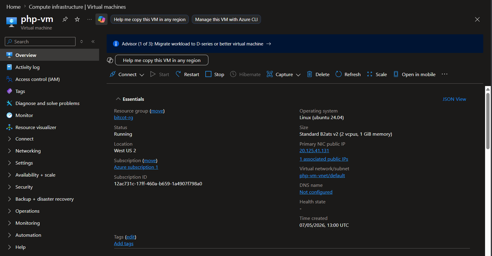
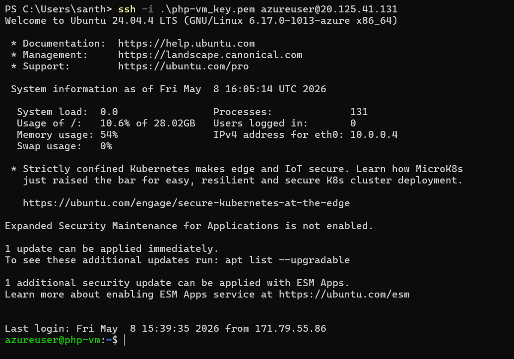
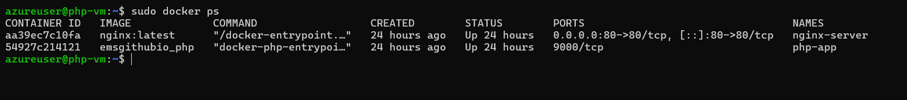
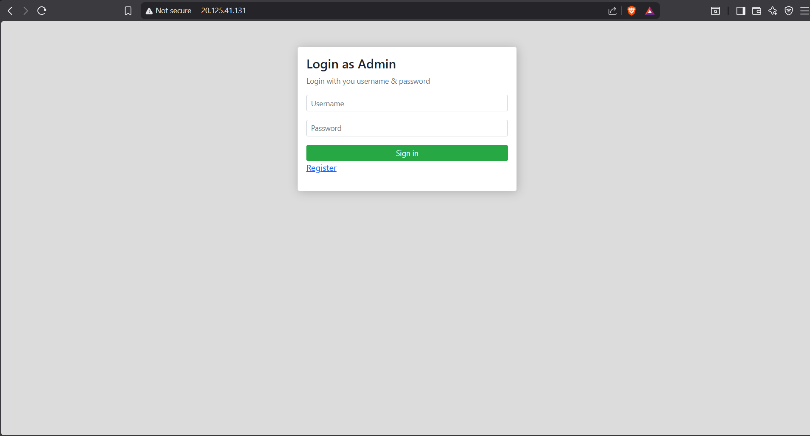
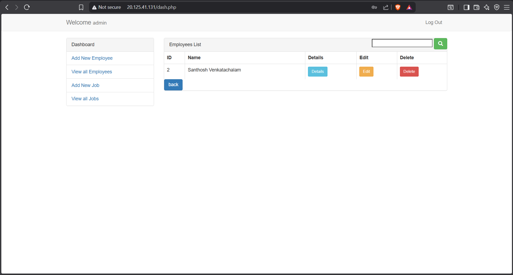
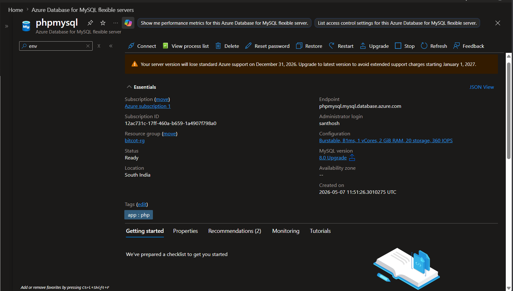
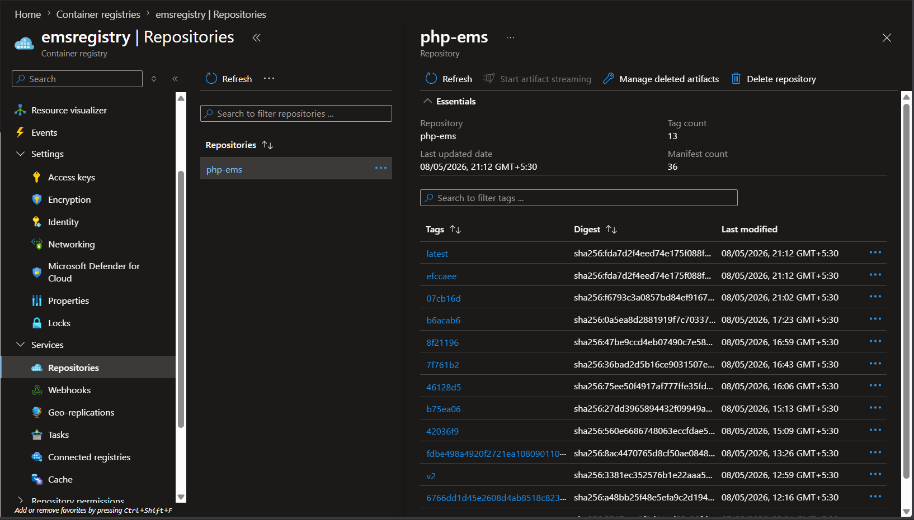
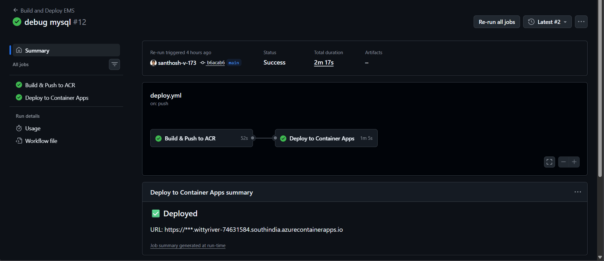
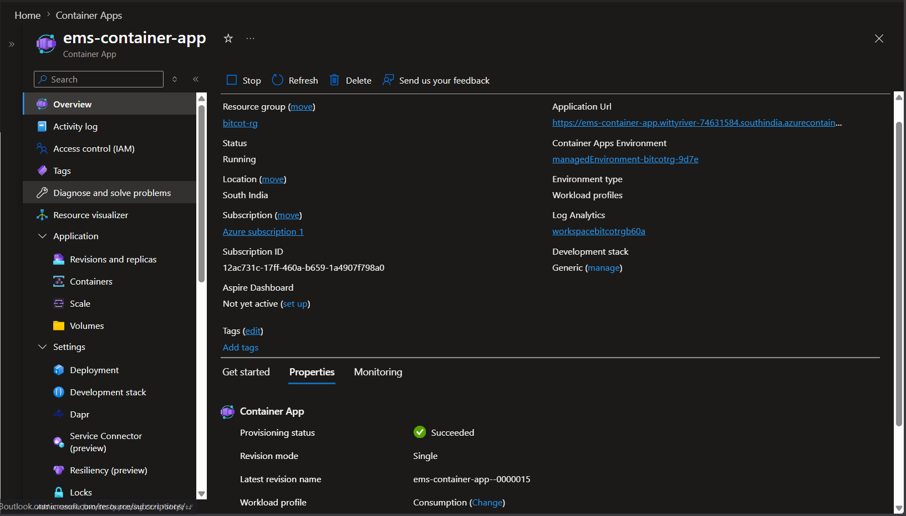
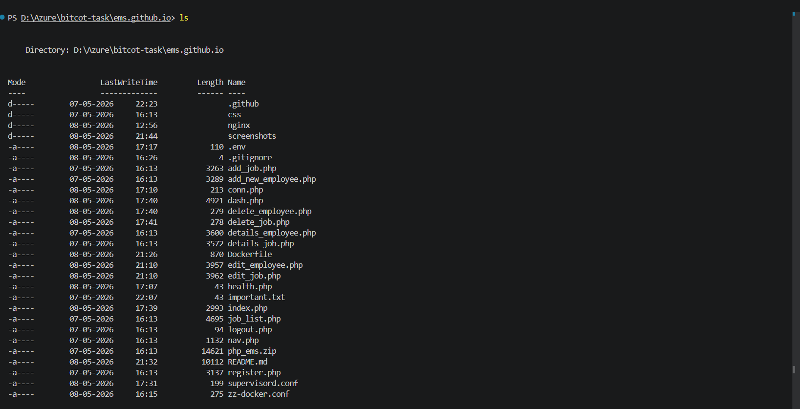

# EMS Application Deployment on Microsoft Azure

## Project Overview

This project demonstrates the deployment of a PHP-based Employee Management System (EMS) using Docker on Microsoft Azure.

The project includes:

- Manual deployment on Azure Ubuntu Virtual Machine using Docker Compose
- Automated CI/CD deployment using GitHub Actions
- Azure Container Registry (ACR)
- Azure Container Apps
- Azure Database for MySQL

---

# Technologies Used

- PHP
- MySQL
- Docker
- Docker Compose
- Nginx
- GitHub Actions
- Azure Ubuntu Virtual Machine
- Azure Container Registry (ACR)
- Azure Container Apps
- Azure Database for MySQL

---

# Project Architecture

## Manual Deployment Architecture

```text
Azure Ubuntu VM
    ├── Docker Compose
    ├── PHP Container
    ├── Nginx Container
    └── Azure MySQL
```

---

## CI/CD Deployment Architecture

```text
GitHub Repository
        ↓
GitHub Actions
        ↓
Azure Container Registry
        ↓
Azure Container Apps
        ↓
Azure Database for MySQL
```

---

# Application Features

- User Authentication
- Add Employee
- Edit Employee
- Delete Employee
- Store Data in Azure MySQL
- Retrieve and Display Data
- Dockerized Deployment
- Automated CI/CD Pipeline

---

# Manual Deployment on Azure VM

## Azure VM Setup

An Ubuntu Linux Virtual Machine was created on Microsoft Azure.

Docker and Docker Compose were installed manually on the VM.

---

# Docker Compose Configuration

## docker-compose.yml

```yaml
version: '3'

services:

  php:
    build: .
    container_name: php-app
    volumes:
      - .:/var/www/html

  nginx:
    image: nginx:latest
    container_name: nginx-server
    ports:
      - "80:80"
    volumes:
      - .:/var/www/html
      - ./nginx/default.conf:/etc/nginx/conf.d/default.conf
    depends_on:
      - php
```

---

# Manual Deployment Commands

## Clone Repository

```bash
git clone <repository-url>
cd <repository-name>
```

---

## Build and Run Containers

```bash
docker-compose up -d --build
```

---

## Verify Running Containers

```bash
docker ps
```

---

## Access Application

```text
http://<VM-PUBLIC-IP>
```

---

# CI/CD Deployment Using GitHub Actions

The CI/CD pipeline performs:

- Build Docker image
- Push Docker image to Azure Container Registry
- Deploy latest image to Azure Container Apps

---

# GitHub Actions Workflow

Workflow file location:

```text
.github/workflows/deploy.yml
```

---

# Azure Services Used

## Azure Ubuntu Virtual Machine

Used for manual Docker deployment.

---

## Azure Database for MySQL

Used as backend database for storing employee information.

---

## Azure Container Registry (ACR)

Used for storing Docker images.

---

## Azure Container Apps

Used for automated container deployment.

---

# Environment Variables

| Variable | Description |
|---|---|
| DB_HOST | Azure MySQL Host |
| DB_USER | MySQL Username |
| DB_PASS | MySQL Password |
| DB_NAME | Database Name |
| DB_PORT | MySQL Port |

---

# Important Difference Between Manual Deployment and Automation Deployment

## Manual VM Deployment

The manual deployment uses:

- Docker Compose
- Separate PHP and Nginx containers
- Standard Nginx image
- No supervisord.conf required
- No zz-docker.conf required

Files used:

```text
docker-compose.yml
Dockerfile
nginx/default.conf
```

---

## Azure Container Apps Deployment

The automated deployment uses:

- Single container architecture
- Nginx + PHP-FPM in one container
- Supervisord to run multiple services
- Health probes for Azure Container Apps

Additional files required:

```text
supervisord.conf
zz-docker.conf
health.php
```

---

# Required Changes for Automation Deployment

## Dockerfile Changes

For Azure Container Apps deployment:

- Install nginx
- Install supervisor
- Configure php-fpm socket
- Configure health endpoint

---

## nginx/default.conf Changes

For Azure Container Apps deployment:

- Use Unix socket communication
- Add health endpoint
- Configure php-fpm integration

---

# Screenshots

## 1. Azure Ubuntu Virtual Machine

Screenshot showing:
- VM Name
- Ubuntu Linux
- Running Status
- Public IP Address



---

## 2. SSH Access to Azure VM

Screenshot showing successful SSH connection.

```bash
ssh azureuser@<vm-public-ip>
```



---

## 3. Docker Containers Running on VM

Screenshot showing Docker containers running successfully.

```bash
docker ps
```



---

## 4. Application Running on Azure VM

### Login Page



### Dashboard



---

## 5. Azure Database for MySQL

Screenshot showing:
- Database overview
- Server name

> Note: Passwords and secrets are hidden.



---

## 6. Azure Container Registry (ACR)

Screenshot showing:
- php-ems repository
- latest image tag
- SHA image tags



---

## 7. GitHub Actions CI/CD Pipeline

Screenshot showing:
- Successful workflow execution
- Build stage
- Deploy stage



---

## 8. Azure Container Apps Deployment

Screenshot showing:
- Healthy revision
- Running status
- Application URL



---

## 9. GitHub Repository Structure

Screenshot showing project structure.



---

# Screen Recording Demonstration

## Recommended Duration

5–8 minutes

---

# What to Explain in Screen Recording

## 1. Project Introduction

Explain:
- Project overview
- Azure services used
- Deployment approach

---

## 2. GitHub Repository

Show:
- Dockerfile
- docker-compose.yml
- GitHub Actions workflow
- nginx configuration

---

## 3. Manual VM Deployment

Show:
- Azure VM
- SSH access
- docker-compose up
- docker ps
- Application via VM public IP

---

## 4. CI/CD Pipeline

Show:
- GitHub Actions workflow
- Docker image build
- Push to ACR
- Deployment to Azure Container Apps

---

## 5. Azure Resources

Show:
- Azure Container Registry
- Azure Container Apps
- Azure MySQL

---

## 6. Application Demonstration

Demonstrate:
- Login
- Add Employee
- Edit Employee
- Delete Employee

---

# Live URLs

## Application URL

```text
---- VM Deployment ----
1. http://20.125.41.131/
---- CI/CD Deployment ----  
2. https://ems-container-app--0000018.wittyriver-74631584.southindia.azurecontainerapps.io/
```

---

## GitHub Repository URL

```text
https://github.com/santhosh-v-173/php-ems-azure
```

---

## Screen Recording URL

```text
https://drive.google.com/file/d/1Flc_3UrdNrABamqlk0dO7O3XtgwUogb6/view?usp=sharing
```

---

# Author

Santhosh
